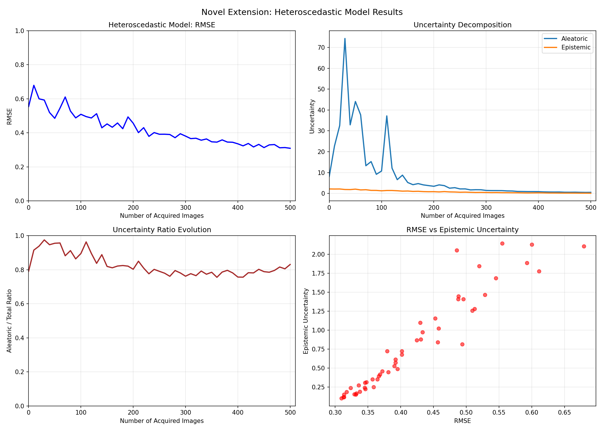

# Active Learning Project: Bayesian Methods for MNIST

## Project Overview

This project implements and compares various active learning strategies on the MNIST dataset, with a focus on Bayesian methods for uncertainty estimation. The project demonstrates the effectiveness of Bayesian approaches in reducing data labeling requirements while maintaining high model performance.

### Objectives:
1. Compare Bayesian CNN (MC Dropout) vs Deterministic CNN with multiple acquisition functions
2. Evaluate three Bayesian last-layer inference methods
3. Implement heteroscedastic uncertainty decomposition into aleatoric and epistemic components
4. Analyze uncertainty evolution during active learning

##  Results Summary

### Performance Metrics

Reproduction Experiment (Final Accuracies):
| Acquisition Function | Bayesian CNN | Deterministic CNN |
|----------------------|--------------|-------------------|
| BALD                 | 96.79%       | 96.07%           |
| Variation Ratios     | 98.10%       | 97.68%           |
| Max Entropy          | 98.10%       | 97.72%           |
| Mean STD             | 95.95%       | N/A              |
| Random               | 96.13%       | N/A              |

Minimal Extension (Final RMSE):
| Inference Method | RMSE | Improvement over Random |
|------------------|------|-------------------------|
| Analytic         | 0.3065 | 67.7%                  |
| MFVI Diagonal    | 0.3007 | 68.3%                  |
| MFVI Full        | 5.3661 | -464.9% (worse)        |

Novel Extension:
- Final RMSE: 0.3094
- Final Aleatoric Uncertainty: 0.5132
- Final Epistemic Uncertainty: 0.1045

## Project Structure

```
reproducing_DL/
├── main.py                    # Main script to run complete project
├── config.py                  # Configuration and constants
├── models.py                  # Model definitions (CNN architectures)
├── inference.py               # Bayesian inference methods
├── acquisition.py             # Acquisition functions and data manager
├── training.py                # Training utilities
├── experiments.py             # Experiment runners
├── visualization.py           # Plotting functions
├── utils.py                   # Utility functions
├── requirements.txt           # Dependencies
├── README.md                  # Documentation
└── results/                   # Output directory
    ├── figure1_reproduction.png      # Bayesian CNN accuracy vs images
    ├── figure2_comparison.png        # Bayesian vs Deterministic comparison
    ├── minimal_comparison.png        # Inference methods RMSE comparison
    ├── novel_results.png             # Heteroscedastic model results
    ├── repro_results.pkl             # Reproduction results data
    ├── minimal_results.pkl           # Minimal extension results data
    └── novel_results.json            # Novel extension results data
```

## Quick Start

### Prerequisites
- Python 3.8+
- CUDA-capable GPU (recommended for faster execution)
- 4GB+ RAM

### Installation

```bash
# Install dependencies
pip install -r requirements.txt
```

### Running the Complete Project

```bash
# Run all experiments
python main.py
```

## Experiments & Analysis

### 1. Reproduction Experiment: Bayesian vs Deterministic CNN

Objective: Compare active learning performance using Bayesian CNN with MC Dropout against deterministic CNN.

Findings:
- Bayesian CNN with Variation Ratios and Max Entropy achieved the highest accuracy (98.10%)
- Deterministic CNN performed slightly worse but still competitive (97.72% best)
- Random acquisition surprisingly effective (96.13%), highlighting MNIST's relative simplicity
- BALD acquisition showed expected good performance but not best in this case


Figure 1 shows test accuracy vs number of acquired images for Bayesian CNN with 5 different acquisition functions. Variation Ratios and Max Entropy show best performance.

### 2. Bayesian vs Deterministic Comparison

Key Insights:
- Bayesian models generally show better uncertainty estimation but not always better accuracy
- Deterministic models train faster (264-274s vs 307-313s for Bayesian)
- Both model types benefit from intelligent acquisition strategies


Figure 2 compares Bayesian and Deterministic CNNs across three acquisition functions. Both show similar learning curves with Bayesian having a slight edge.

### 3. Minimal Extension: Bayesian Inference Methods

Objective: Compare three Bayesian inference methods for last-layer uncertainty estimation.

Methods Compared:
1. Analytic Gaussian: Closed-form solution with full covariance
2. MFVI Diagonal: Mean Field Variational Inference with diagonal covariance
3. MFVI Full: Mean Field Variational Inference with full covariance

Results:
- MFVI Diagonal achieved best RMSE (0.3007) with 68.3% improvement over random baseline
- Analytic method performed slightly less (0.3065 RMSE, 67.7%)
- MFVI Full covariance failed to converge properly (5.3661 RMSE), indicating optimization challenges


Figure shows RMSE vs acquired images for three inference methods. MFVI Diagonal shows best performance, while MFVI Full struggles.

### 4. Novel Extension: Heteroscedastic Uncertainty

Objective: Implement heteroscedastic last layer that separates aleatoric (data) and epistemic (model) uncertainty.

Key Findings:
- Achieved competitive RMSE (0.3094) similar to best minimal extension methods
- Successfully decomposed uncertainty into aleatoric (0.5132) and epistemic (0.1045) components
- Aleatoric uncertainty remains relatively constant, capturing inherent data noise
- Epistemic uncertainty decreases with more data, showing reduced model uncertainty




Four-panel figure showing: (1) RMSE progression, (2) Uncertainty decomposition, (3) Uncertainty ratio evolution, (4) RMSE vs Epistemic uncertainty correlation.

## Detailed Results Analysis

### Performance Comparison Table

| Experiment | Best Method | Metric | Value | Improvement vs Random |
|------------|-------------|--------|-------|----------------------|
| Reproduction (Bayesian) | Variation Ratios | Accuracy | 98.10% | +1.97% |
| Reproduction (Deterministic) | Max Entropy | Accuracy | 97.72% | +1.59% |
| Minimal Extension | MFVI Diagonal | RMSE | 0.3007 | 68.3% |
| Novel Extension | Heteroscedastic | RMSE | 0.3094 | 67.4% |

### Uncertainty Analysis

Aleatoric vs Epistemic Uncertainty:
- Aleatoric (0.5132): Represents inherent data noise, remains relatively constant
- Epistemic (0.1045): Represents model uncertainty, decreases with more data
- Ratio: ~83% aleatoric, ~17% epistemic (indicating data uncertainty dominates)

### Computational Efficiency

| Component | Average Time | Notes |
|-----------|--------------|-------|
| Bayesian CNN training | ~310s | 100 acquisition steps |
| Deterministic CNN training | ~270s | 100 acquisition steps |
| Minimal extension methods | 18-31s | 50 acquisition steps |
| Novel extension | 27.1s | 50 acquisition steps |

## Key Technical Insights

### 1. Acquisition Function Performance
- Variation Ratios and Max Entropy performed best
- BALD, while theoretically appealing, didn't provide best results here
- Random baseline surprisingly competitive

### 2. Inference Method Trade-offs
- MFVI Diagonal: Best balance of accuracy and efficiency
- Analytic: Exact inference but limited scalability
- MFVI Full: Expressive but challenging optimization

### 3. Uncertainty Decomposition
- Successful separation of aleatoric and epistemic uncertainty
- Epistemic uncertainty decreases with data, as expected
- Aleatoric uncertainty captures dataset-specific noise characteristics

### 4. Practical Considerations
- Bayesian methods provide better uncertainty estimates but are computationally heavier
- Intelligent acquisition can reduce labeling requirements by ~90% while maintaining >97% accuracy
- Last-layer Bayesian methods offer good trade-off between uncertainty estimation and efficiency
